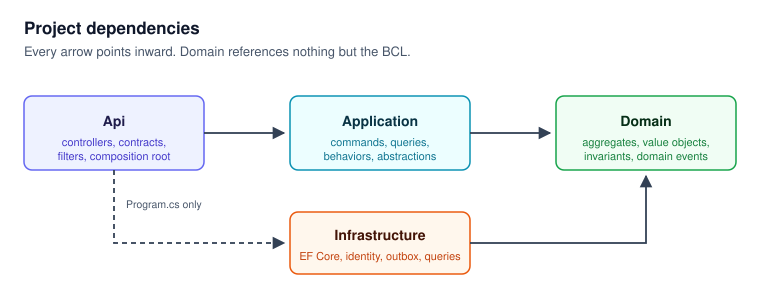
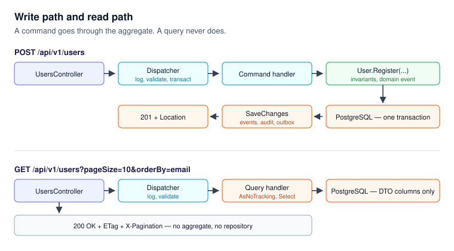

# Architecture

## Layers



Four projects, with every dependency pointing inward (ADR 0001).

| Project | Holds | References |
|---|---|---|
| `Domain` | Aggregates, value objects, enumerations, domain events, repository interfaces, `Result` | Nothing but the BCL |
| `Application` | Commands, queries, handlers, validators, pipeline behaviors, abstractions Infrastructure implements | `Domain` |
| `Infrastructure` | `AppDbContext`, configurations, repositories, interceptors, Argon2, JWT, outbox, query handlers | `Domain`, `Application` |
| `Api` | Controllers, HTTP contracts, mappers, filters, error handling, composition root | `Application`, and `Infrastructure` only in `Program.cs` and `Extensions/` |

The rule is checked mechanically on every pull request: `Domain` may hold no
`PackageReference`, `Application` no EF Core or ASP.NET using, and no
controller may name an Infrastructure type.

## The two request paths



**Writes** go through the domain. The controller maps the request to a command,
the dispatcher wraps the handler in logging, validation and a transaction, and
the handler orchestrates — it holds no business rule. The aggregate enforces
its invariants and raises domain events, which are dispatched *before* commit,
inside the same transaction, so a failing handler rolls the write back (ADR
0007). Anything that must leave the service is written to the outbox in that
same transaction and published afterwards (ADR 0008).

**Reads** do not. A query handler reads `AppDbContext` with `AsNoTracking` and
projects straight into a DTO, so the database returns only the columns the DTO
needs — the password hash is never selected on a read. There is no aggregate
and no repository on this path (ADR 0016).

## Middleware order

```
ForwardedHeaders          → the real scheme and caller address behind a proxy
CorrelationId             → one id per request, in every log line and the response
Serilog request logging
IExceptionHandler chain   → domain → concurrency → global, all to problem details
Security headers
HSTS + HTTPS redirection  → production only
Routing
CORS                      → preflight answered before any auth challenge
Authentication            → before the limiter: read/write policies key on user id
Rate limiter
Authorization
Endpoints                 → controllers, health, OpenAPI, Scalar
```

The order is not stylistic. Rate limiting sits after routing because
per-endpoint policies need the resolved endpoint, and after authentication
because two of the three policies partition by user id.

## Model types

| Group | Lives in | Examples | Crosses a boundary? |
|---|---|---|---|
| HTTP contracts | `Api` | `RegisterUserRequest`, `UserResponse`, `V2.UserResponse` | Serialized to the client. Versioned. |
| Application messages | `Application` | `RegisterUserCommand`, `GetUsersQuery`, `UserDto`, `PagedList<T>` | Never serialized. |
| Domain model | `Domain` | `User`, `Email`, `UserStatus` | Also the persistence model (ADR 0004). |
| Infrastructure types | `Infrastructure` | `OutboxMessage`, `AuditLogEntry`, `UserConfiguration` | Never leave the layer. |

Contracts are separate from commands on purpose (ADR 0011), and M5 collected
the payoff: `GET /api/v2/users/{id}` returns a single `displayName` instead of
two name fields, and neither the query, the read model nor the aggregate moved.

## Schema

```
users              id uuid PK, email citext UNIQUE, password_hash text,
                   name_first text, name_last text, status_id int,
                   created_at_utc timestamptz, updated_at_utc timestamptz
roles              id uuid PK, name text UNIQUE
permissions        id uuid PK, code text UNIQUE
user_roles         id uuid PK, user_id FK, role_id FK, assigned_at_utc, UNIQUE (user_id, role_id)
role_permissions   id uuid PK, role_id FK, permission_id FK, UNIQUE (role_id, permission_id)
refresh_tokens     id uuid PK, user_id FK, token_hash varchar(64) UNIQUE,
                   expires_at_utc, revoked_at_utc, replaced_by_id uuid, xmin (concurrency)
audit_log          id bigint identity PK, actor_id uuid, action text,
                   entity text, entity_id uuid, payload jsonb, at_utc timestamptz
outbox_messages    id uuid PK, type text, payload jsonb,
                   occurred_on_utc, processed_on_utc, attempts int, error text
```

Aggregate boundaries are wider than the foreign keys suggest:

- `User` = `users` + `user_roles`. A row in `user_roles` changes only through
  `user.AssignRole(roleId)`.
- `Role` = `roles` + `role_permissions`.
- `RefreshToken` is its own aggregate: it rotates on every refresh, and putting
  it inside `User` would load and lock the whole user on every token exchange.
- `audit_log` and `outbox_messages` are infrastructure, not domain.

References between aggregates are foreign keys, never navigation properties —
`UserRole` holds a `RoleId`, not a `Role`. That single rule is what keeps the
aggregates from collapsing into one graph, and a reflection test in the domain
test project enforces it.

Schema choices worth naming: `citext` for email gives case-insensitive
uniqueness without a functional index; `status_id` is an `int` because
`UserStatus` is an enumeration class rather than a C# `enum` (ADR 0006);
`replaced_by_id` records the rotation chain, which is what makes reuse
detection possible; and `audit_log` carries a trigger that refuses `UPDATE` and
`DELETE`, because the application connects as the owner of the table and a
`REVOKE` would not bind it.

## Security

- Argon2id password hashing, parameters from configuration, stored PHC-style.
- HS256 access tokens, fifteen minutes, zero clock skew. Claims: `sub`,
  `email`, `jti`, one `permission` per code — no role name reaches the token.
- Refresh tokens are stored only as SHA-256 hashes, rotate on every use, and
  a replayed token revokes every active token for that account (ADR 0009).
- Authorization names a permission, never a role (ADR 0010). No bare
  `[Authorize]` exists in the project.
- Every write is attributed to an actor in the append-only audit log; payloads
  record which fields changed, never their values.
